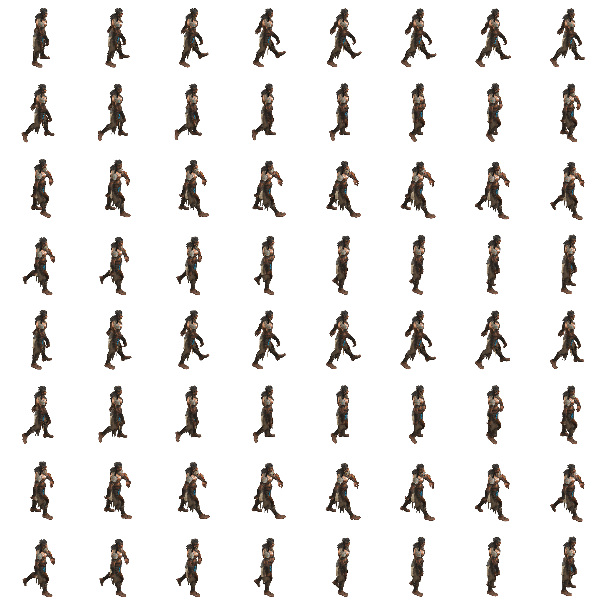

# Character Animation Toolkit

A comprehensive tool for viewing 3D character models, creating sprite sheets, and exporting animations.

## Features

### 3D Model Viewer
- Loads and displays character models in GLB or FBX format
- Automatic fallback to simple character if no model is found
- Orthographic camera with side view perfect for 2D game sprites
- Camera controls:
  - Mouse wheel zoom
  - Arrow keys for precise positioning
  - Camera reset button

### Animation Player
- Plays animations included in the model
- Animation selector dropdown for multiple animations
- Play/pause controls
- Shows animation information

### Sprite Sheet Generator
- Creates sprite sheets from any animation
- Customizable settings:
  - Number of frames to capture
  - Grid layout (columns)
  - Cell dimensions (width & height)
- Content optimization:
  - Centers characters in frames
  - Maintains transparent background
  - Preserves exact cell dimensions
- Exports both sprite sheet image (PNG) and metadata (JSON)

### Animation Viewer & GIF Exporter
- View and play created sprite sheets
- Export animations as GIF files
- Customizable GIF settings:
  - Animation speed (FPS)
  - Quality
  - Scale
  - Loop/no-loop option
- Live preview and direct download

## Example Outputs

### Sample Sprite Sheet


*Generated sprite sheet with 64 frames arranged in a 8x8 grid.*

### Exported GIF Animation
 

*The resulting smooth animation exported as a GIF file.*

## Getting Started

### Installation
1. Clone or download this repository
2. No build step required - it runs directly in the browser
3. For local development, use a web server to serve the files

### Creating Sprite Sheets
1. Load your model and select the desired animation
2. Position the camera for the perfect view:
   - Use arrow keys for precise positioning
   - Use mouse wheel to zoom in/out
3. Configure sprite sheet settings:
   - Number of frames (16-64 recommended)
   - Number of columns (4-8 recommended)
   - Cell dimensions (in pixels)
   - Toggle "Center content" for better framing
4. Click "Record Sprite Sheet"
5. Two files will be automatically downloaded:
   - `[animation_name]_spritesheet.png`: The sprite sheet image
   - `[animation_name]_metadata.json`: Metadata for using the sprite sheet

### Viewing & Exporting Animations
1. Open `sheet-animation.html` in your browser
2. Click "Load Sprite Sheet" and select your PNG file
3. Load the corresponding metadata JSON file
4. Use play/pause controls to preview the animation
5. Adjust playback speed using the slider
6. Configure GIF export settings:
  - FPS: Frames per second
  - Scale: Size multiplier
  - Loop: Whether the GIF should repeat
  - Quality: Lower values = smaller file size
7. Click "Generate GIF"
8. Preview the GIF and click "Download GIF" to save it

## File Structure

```
/c:/source/game/
├── index.html              # Main 3D model viewer and sprite sheet generator
├── sheet-animation.html    # Sprite sheet viewer and GIF exporter
├── README.md               # This file
├── js/
│   ├── fbxViewer.js        # Main viewer functionality
│   ├── SpriteSheetHelper.js# Helper functions for sprite sheet generation
│   └── GifExporter.js      # Utility for exporting animations as GIFs
├── models/
│   └── character.glb       # Your 3D character model (put yours here)
└── sprites/
    ├── character.png       # Generated sprite sheet
    └── character.json      # Generated metadata
```

## Metadata Format

The generated JSON metadata file contains:

```json
{
  "frameWidth": 256,        // Width of each cell in pixels
  "frameHeight": 256,       // Height of each cell in pixels
  "frames": 16,             // Total number of frames
  "columns": 4,             // Number of columns in grid
  "rows": 4,                // Number of rows in grid
  "animationName": "walk",  // Name of the animation
  "optimized": true,        // Whether frames were optimized
  "transparent": true,      // Whether background is transparent
  "fps": 24,                // Recommended playback speed
  "cameraPosition": {       // Camera position data
    "offsetX": 0,
    "offsetY": -0.25
  }
}
```

## Browser Compatibility

- Chrome 70+
- Firefox 65+
- Edge 80+
- Safari 13+

## Dependencies

- [BabylonJS](https://www.babylonjs.com/) - 3D rendering engine
- [gif.js](https://github.com/jnordberg/gif.js) - GIF encoding library

## Tips for Best Results

1. **Positioning**: Use the camera controls to center your character before recording
2. **Frame Count**: More frames = smoother animation but larger files
3. **Transparent Background**: Already enabled by default
4. **Size Optimization**: Enable "Center content" for more efficient sprite sheets
5. **Consistent Lighting**: The default lighting is optimized for side view animations
6. **GIF Quality**: Use lower quality values (5-10) for smaller file sizes

## Using in Your Game

### HTML5 Canvas Example
```javascript
// Load the sprite sheet image
const spriteSheet = new Image();
spriteSheet.src = 'sprites/character_walk_spritesheet.png';

// Animation parameters from metadata.json
const frameWidth = 256;
const frameHeight = 256;
const columns = 4;

let currentFrame = 0;
const fps = 24;
const frameInterval = 1000 / fps;
let lastFrameTime = 0;

function drawFrame(timestamp) {
    if (!lastFrameTime) lastFrameTime = timestamp;
    
    // Calculate elapsed time since last frame
    const elapsed = timestamp - lastFrameTime;
    
    // Update animation if it's time for next frame
    if (elapsed >= frameInterval) {
        currentFrame = (currentFrame + 1) % totalFrames;
        lastFrameTime = timestamp;
    }
    
    // Calculate position in sprite sheet
    const col = currentFrame % columns;
    const row = Math.floor(currentFrame / columns);
    
    // Clear canvas
    ctx.clearRect(0, 0, canvas.width, canvas.height);
    
    // Draw the current frame
    ctx.drawImage(
        spriteSheet,
        col * frameWidth, row * frameHeight, frameWidth, frameHeight,
        0, 0, canvas.width, canvas.height
    );
    
    requestAnimationFrame(drawFrame);
}

// Start the animation
spriteSheet.onload = () => requestAnimationFrame(drawFrame);
```

### Phaser Example
```javascript
// In your game's preload method
function preload() {
    // Load the generated sprite sheet
    this.load.spritesheet('character', 
        'sprites/character_walk_spritesheet.png',
        { 
            frameWidth: 256, 
            frameHeight: 256 
        }
    );
}

// In create method
function create() {
    // Create the animation
    this.anims.create({
        key: 'walk',
        frames: this.anims.generateFrameNumbers('character', { start: 0, end: 15 }),
        frameRate: 24,
        repeat: -1
    });
    
    // Create a sprite and play the animation
    const player = this.add.sprite(400, 300, 'character');
    player.play('walk');
}
```

## License

MIT License - Feel free to use for personal or commercial projects.

## Credits

Developed as a tool for game developers to easily create sprite sheets from 3D models.